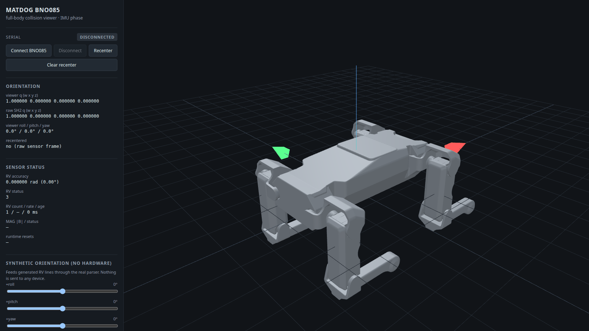

# MATDOG — BNO085 full-body viewer

Standalone, local, browser-based 3D viewer that renders the **complete MATDOG
collision geometry** from the canonical URDF and drives `base_link` with the
live **BNO085 `SH2_ROTATION_VECTOR`** quaternion read over **Web Serial**.

Current phase is strictly an IMU / full-body viewer. The robot moves as a rigid
body; joint animation is architecturally ready but not connected to any servo
telemetry.



*The viewer rendering the canonical MATDOG collision geometry: the complete
17-link articulated model in its neutral URDF pose, driven by the BNO085
orientation stream applied to `base_link`. Captured with `?sim=1` so the image
is reproducible without hardware or serial state.*

---

## Validation status

**Final state: validated on real hardware, not only synthetically.**

| Item | State |
| --- | --- |
| Source of truth | canonical MATDOG URDF `03_CAD/URDF/matt_robodog_rev00/matt_robodog_rev00.urdf` |
| Collision geometry | 17 collision STL meshes, all loaded and rendered |
| Kinematics | 16 joints total, 12 of them revolute |
| Scene graph | full articulated URDF tree — one object per link, nothing flattened |
| Hardware link | ESP32-S3 + BNO085 over browser Web Serial |
| Orientation source | `SH2_ROTATION_VECTOR` (RV) only |
| Recenter | viewer-only quaternion reference; nothing is written to the sensor |
| Layout | responsive full-window viewport |
| Rendering | neutral grey MATDOG material |

### Real-hardware validation — PASS

Performed on the physical robot with the ESP32-S3 + BNO085 connected over Web
Serial, against the frozen MATDOG conventions:

| Motion | Expected | Result |
| --- | --- | --- |
| +ROLL | left side of the robot rises | **PASS** |
| +PITCH | nose / front goes down | **PASS** |
| +YAW | nose turns left seen from above | **PASS** |

- **RV status remained healthy** throughout the validation.
- **No visible quaternion flip or jump was observed** — the `q ≡ -q` hemisphere
  handling behaved as designed.

### Automated checks

- `npm run verify` — **PASS**
- **59 / 59 tests PASS**
- production build succeeds

### Deferred

**Representative full MATDOG electrical-load magnetometer validation (Phase
E-C2) is still deferred**, until the complete robot power / servo system can be
exercised safely. The orientation results recorded above were obtained without
that representative electrical load present, and say nothing about magnetometer
behaviour under it.

### BNO085 DCD baseline

The currently persisted BNO085 DCD is the **validated installed / no-load
baseline**. It **must not be rewritten merely for viewer use**. No viewer
workflow requires a new DCD save, and this viewer could not perform one in any
case: it has no serial write path at all (see [Safety boundary](#safety-boundary)).

---

## Purpose

- Show the full articulated MATDOG model in a deterministic neutral URDF pose,
  with no hardware attached.
- Connect directly to the ESP32-S3 from the browser and apply the live RV
  quaternion to the robot root.
- Give the operator an unambiguous visual check of the frozen `+ROLL`,
  `+PITCH`, `+YAW` conventions, with and without hardware.

Non-goals for this phase: servo telemetry, ROS, NormaCore Station integration,
Python bridges, any write path towards the robot.

---

## Architecture

```
canonical URDF (repo, read-only)
        │
        │  scripts/sync_canonical_assets.mjs   (npm predev / prebuild / pretest)
        ▼
public/canonical/matt_robodog_rev00/           (generated, gitignored)
   matt_robodog_rev00.urdf                     byte-identical copy
   meshes/collision/*.stl                      17 collision meshes only
   CANONICAL_PROVENANCE.json                   sha256 of every staged file
        │
        │  fetch()
        ▼
src/urdf/parseUrdf.ts        pure URDF → link/joint/collision description
src/urdf/buildRobot.ts       description + STL loader → Three.js scene graph
        │
        ▼
   rootObject                     ← IMU orientation is written here, only here
     base_link
       base_link__collision_origin → Mesh (scale 0.001)
       lf_hip_joint__origin        ← static URDF joint origin
         lf_hip_joint__articulation ← ONLY this rotates with the joint value
           lf_hip_link
             …
```

Orientation path:

```
Web Serial (read-only) ─┐
                        ├─► parseSensorLine → RV record
synthetic RV lines ─────┘            │
                                     ▼
                     OrientationController   raw / reference / viewer
                                     │
                                     ▼
                       MatdogRobot.setRootOrientation()
```

Design decisions worth knowing:

- **No framework.** Plain TypeScript + Vite + Three.js. No React, no Station
  code, no Station theme, no protobuf, no device manager.
- **Own URDF parser instead of `urdf-loader`.** `urdf-loader` does support
  `parseCollision`, but a hand-written parser for the subset the canonical URDF
  actually uses is ~250 lines, has no DOM/fetch coupling, and can therefore be
  unit-tested in Node against the real repository files. That is what makes
  "all 17 collision meshes really load" a testable claim rather than a hope.
- **Joint origin and articulation are separate objects.** Writing a joint value
  never accumulates error, and writing the root orientation can never disturb
  joint pose. Both properties are covered by tests.
- **No runtime dependency on the Geometry Compiler.** Its conventions
  (`world_from_link ∘ collision_origin`, mm→m via `scale`) were used as
  reference only.

---

## Source of truth

```
03_CAD/URDF/matt_robodog_rev00/matt_robodog_rev00.urdf
sha256 3890a3f0732dbed8abdc559106d7f32ee8d6e2111c8e1a06d2485bf2ffc81e59
```

Verified facts (asserted by the test suite, not assumed):

| Property | Value |
| --- | --- |
| Links | 17 (`base_link` + 4 legs × 4) |
| Joints | 16 — 12 revolute, 4 fixed foot joints |
| Collision meshes | 17, one per link, all under `meshes/collision/` |
| Mesh scale | `0.001 0.001 0.001` (STL authored in mm, URDF in metres) |
| Root link | `base_link` |
| Frame | +X forward, +Y left, +Z up, right-handed |

The canonical URDF sha256 is also cross-checked against the pin in
`06_Software/Matdog_Core/kinematics/matdog_urdf_fk.py`, so a silent change to
the canonical model fails the tests.

The canonical URDF and canonical STL files are **never written to**. The only
generated content is the staged copy under `public/canonical/`, which is
regenerated from scratch on every run and is gitignored — there is exactly one
maintained geometry definition.

---

## Collision-mesh strategy

`<collision>` only. The heavy `<visual>` meshes are never fetched, never
staged, and never rendered. The staging script copies only the STLs referenced
by a `<collision>` element (5.8 MB, 119 696 triangles).

If any referenced collision mesh is missing, empty, or an unfetched git-lfs
pointer, staging fails loudly. If any mesh fails to load at runtime, the whole
robot build rejects rather than rendering a silently incomplete model.

Meshes are **not merged**: every URDF link stays a separate `Object3D` so joint
animation can be added later.

---

## Dependencies

Runtime:

| Package | Version | Why |
| --- | --- | --- |
| `three` | ^0.185.1 | renderer, scene graph, `STLLoader`, `OrbitControls` |

Dev only:

| Package | Version | Why |
| --- | --- | --- |
| `vite` | ^7.2.0 | dev server + build |
| `typescript` | ^5.9.3 | type checking (`noEmit`) |
| `vitest` | ^3.2.4 | test runner |
| `@types/three`, `@types/node`, `@types/w3c-web-serial` | — | typings |
| `@xmldom/xmldom` | ^0.9.12 | DOM parser for the Node-side URDF tests only |

No backend. No server-side code of any kind.

---

## Install / run / build

```bash
cd 06_Software/Matdog_Core/viewer/matdog_bno085_fullbody_viewer
npm install
```

Development server (stages the canonical assets first, then serves on
<http://127.0.0.1:5183>):

```bash
npm run dev
```

Production build and local preview of the build:

```bash
npm run build
npm run preview
```

Everything at once (staging, typecheck, tests, build):

```bash
npm run verify
```

Other scripts: `npm run sync:assets`, `npm run typecheck`, `npm test`.

---

## Layout and viewport sizing

Desktop layout is a CSS grid: a fixed 336 px telemetry sidebar on the left and
a viewer column of `minmax(0, 1fr)` that takes all remaining width and the full
viewport height. Below 860 px the layout stacks (panel above, viewer below).
`body` does not scroll; only the panel does, so the canvas never produces a
page scrollbar.

The canvas **display size is owned by CSS** (`width/height: 100%` of the
stage). The renderer only ever sets the drawing buffer — every `setSize` call
passes `updateStyle = false` — so an inline pixel size can never freeze the
canvas at a stale size. A `ResizeObserver` on the actual viewer container is
the primary trigger, a `window` resize listener additionally covers
`devicePixelRatio` changes, and the render loop re-checks the container box
each frame as a safety net (a no-op unless the box really changed). Each resize
updates `camera.aspect`, `camera.updateProjectionMatrix()`,
`renderer.setPixelRatio()` and `renderer.setSize()` together, so maximising or
resizing the window is immediate, needs no reload and cannot distort the image.
OrbitControls is unaffected.

---

## Browser requirements

- **Chrome or Edge** (desktop). Web Serial is not implemented in Firefox or
  Safari; the model still loads there, only Connect is unavailable.
- A **secure context**: `http://localhost` / `http://127.0.0.1` or https.
  Opening `dist/index.html` over `file://` will not give you Web Serial.
- The Connect button must be pressed by the operator — Web Serial requires a
  user gesture and shows the browser's own port chooser.

---

## Hardware connection

- ESP32-S3 + BNO085 over USB, firmware
  `matdog_bno085_dcd_phase_c3` (unchanged, and not touched by this viewer).
- 115200 baud, 8N1, no flow control.
- The device is chosen in the browser's port picker. **No tty path is
  hard-coded** (a test enforces this). For reference, the persistent Linux path
  of the current unit is
  `/dev/serial/by-id/usb-Espressif_USB_JTAG_serial_debug_unit_14:C1:9F:22:75:94-if00`.

### Serial ownership

A serial port has exactly one owner. **Close the Arduino Serial Monitor**, any
`screen`/`minicom`, and any Python reader before pressing Connect, or the port
will fail to open. Conversely, press Disconnect before reopening the Arduino
monitor.

The firmware prints its block every 500 ms, so the RV update rate is ~2 Hz. The
panel shows RV count, measured rate and the age of the last RV sample so this
cadence is visible rather than mistaken for a stall.

---

## Serial lines consumed

Orientation comes **only** from `SH2_ROTATION_VECTOR` (`RV`).
`GAME_ROTATION_VECTOR` is never used as orientation (also enforced by a test).

```
RV w=0.642151 x=0.005371 y=0.016052 z=-0.766357 accuracy_rad=0.060547 status=3 count=13060
MAG x=-21.688 y=-2.312 z=-42.812 |B|=48.048 status=3 count=13062
GYR x=0.000000 y=0.000000 z=0.000000 |w|=0.000000 status=0
SAVE_GATE ready=NO still_ms=0 ACC=3 GYR=0 MAG=3 RV=3 rv_accuracy_rad=0.060547 gyro_mag=0.000000 runtime_resets=0
COUNTS acc=26124 gyr=26124 mag=13062 game=0 rv=13060 runtime_resets=0
UNEXPECTED_RUNTIME_RESET count=4
```

- `RV` → quaternion, `accuracy_rad`, `status`, `count`
- `MAG` → `|B|`, `status`
- `COUNTS` / `SAVE_GATE` / `UNEXPECTED_RUNTIME_RESET` → runtime reset count
- Everything else (banners, `CAL_*`, `DCD_*`, `GYR`, garbage) is ignored.

An RV line is accepted only when all four quaternion components are present and
finite. Partial lines are buffered until terminated; malformed lines produce no
record and never throw.

---

## Coordinate-frame mapping

The full chain, and why every step is the identity:

```
SH2_ROTATION_VECTOR quaternion  →  MATDOG base_link  →  Three.js root object
```

1. **MATDOG `base_link`** (canonical URDF REV00): +X forward, +Y left, +Z up,
   right-handed.
2. **BNO085 → base_link**, frozen by hardware Phase D validation:
   `SH2 +X → base_link +X`, `SH2 +Y → base_link +Y`, `SH2 +Z → base_link +Z`,
   **identical signs**. No axis permutation and no sign flip is applied
   anywhere in the code.
3. **base_link → Three.js**: this viewer configures the world **Z-up**
   (`Object3D.DEFAULT_UP = (0,0,1)`, `camera.up = +Z`, grid rotated into the XY
   plane), so world axes coincide with `base_link` axes. Three.js's Y-up
   default is deliberately *not* relied on.
4. The **only** conversion performed is the storage order:
   `SH2 (w, x, y, z)` → `THREE.Quaternion (x, y, z, w)`
   (`src/frame/orientation.ts → sh2ToThree`).

Consequences, matching the frozen hardware definitions:

| Rotation | Axis | Visual result |
| --- | --- | --- |
| +ROLL | `base_link +X` | left side of the robot rises |
| +PITCH | `base_link +Y` | nose / front goes down |
| +YAW | `base_link +Z` | nose turns left seen from above |

`q` and `-q` are the same rotation and render identically. The incoming stream
is additionally hemisphere-aligned so the numeric readout does not flip
arbitrarily; the viewer never shows a discontinuity from a sign change.

In the 3D view: **red arrow / red axis = +X forward**, **green arrow / green
axis = +Y left**, blue axis = +Z up — the same three colours are mirrored in
the panel's "world axes" legend. The robot itself uses one neutral material
(medium grey body and links, slightly darker feet), so orientation is read from
the axes and arrows rather than from link colours.

---

## Connect / Disconnect / Recenter

- **Connect BNO085** — opens the browser port chooser, opens the selected port
  read-only at 115200, starts parsing. State badge shows
  `DISCONNECTED → CONNECTING → CONNECTED`, or `ERROR` with a message.
- **Disconnect** — cancels the reader and closes the port, releasing it for the
  Arduino monitor.
- **Recenter** — *viewer-only*. It captures the current raw quaternion as the
  reference and then renders

  ```
  q_viewer = conjugate(q_reference) ⊗ q_raw
  ```

  Pure quaternion algebra, no Euler subtraction. At the instant of recentering
  the robot renders exactly at identity; a subsequent rotation of the physical
  robot about its own body axis then appears as the same rotation about the
  corresponding viewer axis.

  **Recenter sends nothing to the ESP32.** It does not touch BNO085
  calibration, does not write the DCD, and does not alter the raw quaternion,
  which stays visible next to the viewer quaternion in the panel.
- **Clear recenter** — drops the reference; the raw sensor frame is shown again.

---

## Synthetic orientation test mode (no hardware)

Add `?sim=1` (or any of `?roll=`, `?pitch=`, `?yaw=` in degrees) to the URL:

```
http://127.0.0.1:5183/?sim=1
http://127.0.0.1:5183/?roll=25
```

This reveals a small panel with roll/pitch/yaw sliders and the presets
`zero`, `+roll 25°`, `+pitch 25°`, `+yaw 30°`, each printing the expected
visual result. The synthetic source **generates real RV lines and feeds them
through the production parser**, so the synthetic and hardware paths are
identical downstream. Nothing is transmitted to any device.

Without `?sim=1` no debug UI is shown.

A dev handle is also exposed for scripted checks:

```js
await window.matdogViewer.ready;
window.matdogViewer.setSyntheticRpyDeg(25, 0, 0);
window.matdogViewer.feedSerialText('RV w=1 x=0 y=0 z=0 status=3 count=1');
window.matdogViewer.linkWorldPosition('lf_foot_link');
window.matdogViewer.snapshot();
```

---

## Tests

`npm test` (59 tests, 5 files):

| File | Covers |
| --- | --- |
| `tests/canonicalModel.test.ts` | canonical URDF is found; sha256 matches the kinematics pin; 17 links / 16 joints / 12 revolute / 4 fixed; 17 collision meshes, all `meshes/collision/`, all `scale 0.001`; every reference resolves to a real non-empty, non-LFS-pointer STL; an independent regex scanner agrees with the parser (no mesh silently skipped); staging is byte-identical; canonical meshes still match `SHA256SUMS.txt` |
| `tests/robotGraph.test.ts` | builds the robot from the real canonical STLs; exactly 17 meshes loaded; collision set only; a failing mesh rejects the build; hierarchy base→hip→upper→lower→foot; link world positions match the URDF in metres; mm→m scale; body-sized bounding box; joint API moves only its own chain, clamps to URDF limits, rejects fixed/unknown/non-finite, is idempotent; root orientation rotates rigidly, preserves distances and does **not** mutate joint values; `+ROLL`/`+PITCH`/`+YAW` verified on the real geometry |
| `tests/orientation.test.ts` | SH2→THREE order; identity pose; the three frozen conventions; rpy round-trip; `q ≡ -q`; hemisphere alignment; recenter is `conj(ref)⊗raw`, zeroes at capture, reproduces body rotations, survives later samples; controller rejects NaN/∞/zero quaternions without moving the robot; synthetic RV lines round-trip through the production parser |
| `tests/lineParser.test.ts` | real `RV`/`MAG`/`GYR`/`COUNTS`/`SAVE_GATE`/reset lines; banners ignored; 10 malformed variants ignored without throwing; chunk reassembly at 1/3/7/64-byte boundaries; incomplete trailing line held back; buffer bounded |
| `tests/safetyBoundary.test.ts` | scans all shipped source for: any serial write path (`.writable`, `getWriter`, `TextEncoder`…), any firmware/DCD/calibration command (`SAVE`, `STATUS`, `sh2_setDcd*`, `esptool`…), any servo/battery reference (`ST3215`, `torque`, `EEPROM`, `DALY`, `BMS`…), hard-coded tty paths, filesystem writes outside the staging script, and use of `GAME_ROTATION_VECTOR` |

Browser smoke test (dev server and the production `dist`): the page boots with
no console errors, reports 17 links / 16 joints / 17 collision meshes, and WebGL
draws **119 716 triangles** — the canonical collision baseline of 119 696
triangles plus 20 helper triangles. Viewport sizing was checked at 1280×800,
1600×900, 1920×1080, 2560×1400 and a stacked 700×900, with the drawing buffer
and `camera.aspect` tracking the container at every size.

Automated tests cover the software path only. The `+ROLL` / `+PITCH` / `+YAW`
conventions have additionally been confirmed **on the physical robot** with the
BNO085 connected — see [Validation status](#validation-status).

---

## Safety boundary

This viewer is **host-side, read-only software**. It does not and cannot:

- flash or modify ESP32 firmware;
- send `SAVE`, `STATUS` or any other command to the BNO085 firmware;
- modify BNO085 DCD or calibration;
- touch servo EEPROM, address or command ST3215 servos, or enable torque;
- access the servo bus;
- interact with DALY/BMS or enable battery/servo power;
- modify the canonical URDF or the canonical collision STLs;
- write anywhere outside `public/canonical/` inside this directory.

The Web Serial transport never acquires `port.writable` and never creates a
writer — there is no code path from this application to the device. This is
enforced mechanically by `tests/safetyBoundary.test.ts`, so it cannot be
regressed silently.

Consequently the persisted BNO085 DCD — the validated installed / no-load
baseline — is untouchable from here, and **must not be rewritten merely for
viewer use** by any other means either. Recenter is a host-side quaternion
operation and is not a substitute for, nor a trigger for, a calibration save.

---

## Future ST3215 joint-state integration point

`MatdogRobot.setJointAngle(jointName, radians)` in `src/urdf/buildRobot.ts` is
the single entry point. It takes URDF joint names (`lf_hip_joint`,
`lf_upper_leg_joint`, …), clamps to the URDF limits and rotates only that
joint's articulation node. `setJointAngles(record)`, `jointValue(name)`,
`jointSnapshot()` and `resetJoints()` are also available.

A future joint-state consumer converts ST3215 counts to radians (using
`MATDOG_JOINT_CALIBRATION.yaml` / `matdog_joint_math.py` semantics, and the
`motorId` / `motorDirection` metadata carried in the URDF `<hardware>` block)
and calls `setJointAngle`. The IMU path writes only `rootObject`, so the two
channels compose without interfering — verified by
`root orientation applies to the whole body only` in `tests/robotGraph.test.ts`.

**Nothing in this viewer may ever write to the servo bus.**

---

## Files created

All new, all inside this directory. No file outside
`06_Software/Matdog_Core/viewer/` was created, modified or deleted.

```
06_Software/Matdog_Core/viewer/matdog_bno085_fullbody_viewer/
├── README.md                        this document
├── docs/
│   └── viewer-preview.png           1600x900 screenshot embedded above
├── package.json                     scripts + dependency manifest
├── package-lock.json                lockfile
├── tsconfig.json                    strict TS config
├── vite.config.ts                   dev server / build / vitest config
├── index.html                       UI shell
├── .gitignore                       node_modules, dist, public/canonical
├── scripts/
│   └── sync_canonical_assets.mjs    read-only canonical staging + provenance
├── src/
│   ├── main.ts                      application wiring, UI, dev handle
│   ├── style.css                    panel + stage styling
│   ├── urdf/
│   │   ├── parseUrdf.ts             pure URDF parser (no Three.js, no DOM API use beyond DOMParser injection)
│   │   └── buildRobot.ts            articulated scene graph + setJointAngle
│   ├── frame/
│   │   ├── orientation.ts           SH2 → base_link → Three.js mapping, quaternion math
│   │   └── orientationController.ts raw / reference / viewer state
│   ├── serial/
│   │   ├── lineParser.ts            firmware text protocol parser + line assembler
│   │   └── webSerial.ts             read-only Web Serial transport
│   ├── viewer/
│   │   ├── scene.ts                 Z-up Three.js scene, lights, grid, axes, responsive sizing
│   │   ├── stlLoader.ts             fetch + STLLoader
│   │   └── linkStyle.ts             neutral MATDOG material (body + darker feet)
│   └── dev/
│       └── syntheticSource.ts       synthetic RV lines for hardware-free checks
└── tests/
    ├── canonicalModel.test.ts
    ├── robotGraph.test.ts
    ├── orientation.test.ts
    ├── lineParser.test.ts
    ├── safetyBoundary.test.ts
    └── support/nodeEnvironment.ts
```

Generated at runtime and gitignored: `node_modules/`, `dist/`,
`public/canonical/`.
