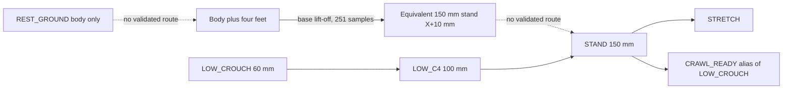

# G3.5 — Full pose repertoire, XGO retargeting and ground-rest audit

## Outcome

- **A true body-supported MATDOG ground rest exists in the canonical rigid model** (`REST_GROUND`, base_link on the ground, all feet clear). It is statically supported by the CAD/URDF COM, and it is an **isolated component**: no validated path connects it to LOW_C4, STAND or any four-foot pose.
- **LOW_C4 is not the lowest four-foot stance.** The lowest validated four-foot configuration sits at body height **0 m** (base_link and all four feet on the ground, `BODY_AND_FOOT_SUPPORT`); the lowest *pure foot-support* height found is **1.001 µm**, a tolerance-bound value. The limiting constraint is **BODY_GROUND_CONTACT**.
- A **251-sample sampled route** takes the body-plus-four-feet family to an *equivalent* 150 mm stand at body X = +10 mm. That end is **not** the canonical STAND, and no route joins them.
- The validated connectivity graph has **12 components** (3 non-trivial, 9 singletons). STAND's component is {CRAWL_READY, LOW_C4, LOW_CROUCH, STAND, STRETCH}. **No body-only rest is in it.**
- **G3 startup is partially superseded**: the premise that LOW_C4 is the only or lowest stance is superseded. The implemented autonomous stand gate is unchanged and BODY_ONLY REST → STAND is **not** authorized.
- XGO recovery is **partial for every one of the 30 dispatcher entries and full for none**. No XGO joint table is used as MATDOG joint geometry.
- No production motion state, gait, actuator binding or calibration behaviour was added.

Everything below is offline, rigid-body, quasi-static and model-based (CAD/URDF MODEL COM, canonical collision meshes). None of it is a measurement, a clearance approval, a load/friction/stability claim, or actuator authorization.

## Reading guide: proven versus found, and what "no route" means

- **PROVEN LIMIT** — a bound that follows from the model geometry itself, independent of the search that found the poses.
- **LOWEST FOUND SO FAR** — the best value the bounded, finite searches reached; it can move with more search.
- **Absence of a validated route** means "no route was found by the bounded searches that were run"; it is never a proof that no route exists. Sampled routes are not swept-collision certificates and do not prove contact lock or no-slip motion.
- **Evidence classes (XGO)**: A = exact trajectory/keyframes recovered; B = exact/static endpoint recovered; C = constrained geometric semantics recovered; D = semantics/name only; E = unrelated/non-postural.

## The 22 required answers

### Q1. Does a true MATDOG REST_GROUND pose exist?

**Yes, under the explicit collision policy.** `REST_GROUND` is `BODY_SUPPORT`: base_link rests on the ground, the four feet and all leg links are clear. 6 body-only candidates are valid in `rest_search.json` (candidates 48, 49, 50, 51, 52, 53); `REST_GROUND` was selected joint-margin-first and `REST_GROUND_MAX_SEPARATION` separation-first. Ground contact was checked for every link and 120 non-adjacent mesh pairs (FCL triangles plus solid containment); 16 direct URDF adjacency pairs are excluded as designed assembly/joint interfaces, and internal adjacent-link clearances are **not** certified. This qualification applies to every geometric claim in this report.

### Q2. What is the exact base_link world Z?

`REST_GROUND_BODY_HEIGHT = 1.0999563076780766e-16 m`, the negative of the canonical base mesh minimum local Z (`-1.0999563076780766e-16 m`). It is effectively zero to mesh precision but was **derived from the collision mesh, not assigned by definition**. The bottom support patch (10 µm band) has 98 triangles, one connected patch, area 0.016235009907 m² and a six-vertex hull. Body orientation is identity.

### Q3. Which links are intended to contact the ground?

For `REST_GROUND` and `REST_GROUND_MAX_SEPARATION`: **base_link only**; feet, hip, upper and lower links remain clear. The two body-plus-four-feet research rests declare **base_link plus the four foot links**. `FOOT_SUPPORT` forbids base and every non-foot contact (C4 policy is not weakened globally); `FREE_SPACE` permits none; `TRANSITIONAL_SUPPORT` requires an explicit non-empty declared set. Permitted contact never permits penetration (1 µm undeclared-contact tolerance, 10 µm support-patch band; numerical model parameters, not clearances).

### Q4. What are the LF/RF/RH/LH semantic joint angles?

Selected `REST_GROUND`, URDF radians (degrees for reading only), identity body rotation, translation (0, 0, 1.1e-16) m:

| Leg | Hip rad | Upper rad | Lower rad | Hip deg | Upper deg | Lower deg |
|---|---|---|---|---|---|---|
| LF | 0.260000000000 | 1.958362087164 | 0.588021958282 | 14.896903 | 112.205882 | 33.691176 |
| RF | -0.260000000000 | 1.958362087164 | 0.588021958282 | -14.896903 | 112.205882 | 33.691176 |
| RH | 0.000000000000 | 2.048195210429 | 0.455068935851 | 0.000000 | 117.352941 | 26.073529 |
| LH | -0.000000000000 | 2.048195210429 | 0.455068935851 | -0.000000 | 117.352941 | 26.073529 |

Alternative candidates, exact transforms and provenance are in [pose_library.json](pose_library.json), [rest_search.json](rest_search.json) and [contact_modes.json](contact_modes.json). The records carry no actuator identifiers or conversions.

### Q5. Do front and rear angles differ because of the 20 mm hip offset?

Front hip Z = 46.5 mm, rear hip Z = 26.5 mm (URDF), a **20.0 mm offset**. In `REST_GROUND` the rear upper joint is **+0.089833123264 rad** and the rear lower joint **-0.132953022431 rad** relative to the front; the rear hip is 0 while the front hips are ±0.26 rad. The differences are outcomes of separate front/rear searches that use the true hip origins; they are not a universal correction. Other poses differ by different amounts:

| Pose | Front upper | Rear upper | Δ upper | Front lower | Rear lower | Δ lower | Rear−front hip |
|---|---|---|---|---|---|---|---|
| REST_GROUND | 1.958362 | 2.048195 | 0.089833 | 0.588022 | 0.455069 | -0.132953 | -0.260000 |
| REST_GROUND_MAX_SEPARATION | 1.958362 | 1.958362 | 0.000000 | 0.654498 | 0.588022 | -0.066477 | -0.260000 |
| LOW_CROUCH | 1.132230 | 1.873112 | 0.740882 | -0.954334 | -1.125835 | -0.171501 | 0.000000 |
| LOW_C4 | 0.859687 | 1.405118 | 0.545431 | -0.471934 | -0.687038 | -0.215103 | 0.000000 |
| STAND | 0.409872 | 0.898334 | 0.488462 | 0.349580 | 0.000782 | -0.348798 | -0.000000 |
| STRETCH | 0.574981 | 0.850406 | 0.275425 | -0.689313 | -0.459549 | 0.229763 | 0.000000 |

Front and rear angles are never forced to be equal.

### Q6. Is REST_GROUND statically supported by the URDF COM?

**Yes.** The CAD/URDF MODEL COM (all 17 inertials, total 2.48 kg) is (-0.024819608, -0.000336008, 0.043698287) m. Its ground projection lies inside the base-patch support hull with margin **40.623130 mm**. Minimum tested non-adjacent separation is **0.661635 mm** (rf_foot_link / rh_hip_link); minimum joint-limit margin **0.066476511 rad**. The maximum-separation alternative reaches 5.755374 mm separation but sits at a joint limit (margin 0.000000 rad). This is rigid CAD geometry, not measured mass, friction, load capacity or dynamic stability.

### Q7. Is REST_GROUND continuously connected to LOW_C4 / STAND?

**No validated connection exists.** `REST_GROUND` is a singleton in the graph. Evidence:

- The original contact-mode and route searches seeded only `REST_GROUND_MAX_SEPARATION`. To close this, the preserved protocol was rerun from **all 6 valid body-only candidates including `REST_GROUND`** (`rest_connectivity.json`): 30 direct 51-sample interpolations to contact-mode endpoints and 12 rear-then-front single-leg detour searches (seeds 17/31/73, 2000 trials each). **0 succeeded.**
- Every direct interpolation fails within the first 8 samples; the colliding pairs are lf_foot_link / lh_hip_link; lf_lower_leg_link / lh_hip_link; rf_foot_link / rh_hip_link; rf_lower_leg_link / rh_hip_link. The first detour leg (RH) never finds a path: its search trees saturate at only 19–38 nodes. The front-leg detour is therefore never reached.
- With base_link on the ground, only 2.33 % (RH) and 5.00 % (LF) of uniformly sampled single-leg joint boxes are clear even when the other legs are ignored. This explains the failures qualitatively; it is not a proof of disconnection.
- The transition record `REST_GROUND → LOW_C4` remains `UNPROVEN_OR_REJECTED`.

A *different* family (base plus four feet) does connect to a 150 mm stand (251 samples), but its end differs from the canonical STAND (Q8, Q22), and the body-only rest does not reach that family.

### Q8. Which support-mode transitions were validated?

Validated means every recorded sample of a saved route passes the full offline policy (`VALIDATED_SAMPLED_ROUTE`). Each route is validated as an ordered sample sequence from the first to the second node; the union-find graph treats it as undirected, and reversed traversal reuses the same samples. Timing, contact acquisition, friction and swept collision are not validated.

| From | To | Regimes | Samples | Status | Source |
|---|---|---|---|---|---|
| LOW_CROUCH | LOW_C4 | FOOT_SUPPORT -> FOOT_SUPPORT | 51 | VALIDATED_SAMPLED_ROUTE | transitions.json:/edges/0 |
| LOW_C4 | STAND | FOOT_SUPPORT -> FOOT_SUPPORT | 51 | VALIDATED_SAMPLED_ROUTE | transitions.json:/edges/1 |
| STAND | STRETCH | FOOT_SUPPORT -> FOOT_SUPPORT | 51 | VALIDATED_SAMPLED_ROUTE | transitions.json:/edges/2 |
| STAND | CRAWL_READY | FOOT_SUPPORT -> FOOT_SUPPORT | 51 | VALIDATED_SAMPLED_ROUTE | transitions.json:/edges/4 |
| BODY_FOUR_FEET_RESEARCH_1 | FOOT_SUPPORT_60MM_FROM_BODY_FOUR_FEET_RESEARCH_1 | BODY_AND_FOOT_SUPPORT -> FOOT_SUPPORT | 60 | VALIDATED_SAMPLED_ROUTE | contact_modes.json:/lift_off_attempts/0 |
| BODY_FOUR_FEET_RESEARCH_2 | FOOT_SUPPORT_60MM_FROM_BODY_FOUR_FEET_RESEARCH_2 | BODY_AND_FOOT_SUPPORT -> FOOT_SUPPORT | 60 | VALIDATED_SAMPLED_ROUTE | contact_modes.json:/lift_off_attempts/1 |
| BODY_FOUR_FEET_RESEARCH_1 | FOUR_FEET_RISE0_ORIGINAL_FOOTPRINT_END | BODY_AND_FOOT_SUPPORT -> FOOT_SUPPORT | 150 | VALIDATED_SAMPLED_ROUTE | route_extension.json:/original_footprint_rises/0 |
| BODY_FOUR_FEET_RESEARCH_2 | EQUIVALENT_STAND_150MM_X10MM | BODY_AND_FOOT_SUPPORT -> FOOT_SUPPORT | 251 | VALIDATED_SAMPLED_ROUTE | route_extension.json:/original_footprint_rises/1/frames + equivalent_stand.json:/routes/1/frames |

Support-mode changes that occur in validated routes: **`BODY_AND_FOOT_SUPPORT` → `FOOT_SUPPORT`** (base lift-off, the four foot patches stay declared) and `FOOT_SUPPORT` → `FOOT_SUPPORT` (G3-family waypoint routes). Attempted and **not** validated: `BODY_SUPPORT` → any foot-added mode (Q7); three-foot support transfer by RH/LH swing (unshifted margin −15.67 mm, a (+20,+20) mm shift permits the RH swing, the later LH swing fails IK); `EQUIVALENT_STAND` → canonical STAND (footprints differ by up to 52.5 mm; no route); STAND → SIT candidate. 51 bounded searches were rejected and are kept in [connectivity.json](connectivity.json).

### Q9. Is LOW_C4 the lowest valid four-foot stance?

**No.** LOW_C4 is a validated 100 mm waypoint. Four-foot poses were validated below it at 60 mm (LOW_CROUCH, also inside STAND's component) and down to **0 m** with base contact. The lowering constraint is BODY_GROUND_CONTACT, not a 100 mm leg limit (Q21). LOW_C4 is not preserved as mandatory for backward compatibility (Q16).

### Q10. What is the lowest validated four-foot height?

| Quantity | Value | Status |
|---|---|---|
| Lowest four-foot height, level body, base_link and four feet on ground (`BODY_AND_FOOT_SUPPORT`) | **0.0 m** | **PROVEN LIMIT** for a level body: a lower body height places canonical base-mesh vertices below the ground. The pose itself is validated (all policies pass at exactly this height in both families). |
| Lowest pure `FOOT_SUPPORT` (base clear, four feet only) | **1.001 µm** | **LOWEST FOUND SO FAR**, bound by the 1 µm undeclared-contact tolerance: heights from 10 nm to 1 µm are rejected as `UNDECLARED_GROUND_CONTACT:base_link`. It is a numerical model tolerance, not a physical clearance approval (`physical_clearance_approval = false`). |
| Highest four-foot height found | 168.332 mm | **HIGHEST FOUND SO FAR**; a necessary (relaxed) upper bound is 168.342 mm, which is not a feasibility proof |

Full resolution of the lower envelope (both foot families):

| Family | Height above body ground, m | Regime | Valid | Errors | Joint margin, rad | Support margin, mm | Min separation, mm |
|---|---|---|---|---|---|---|---|
| 0 | 0.000e+00 | BODY_AND_FOOT_SUPPORT | yes | - | 0.003823 | 110.095 | 7.369 |
| 0 | 1.000e-08 | FOOT_SUPPORT | no | UNDECLARED_GROUND_CONTACT:base_link | - | - | - |
| 0 | 1.000e-07 | FOOT_SUPPORT | no | UNDECLARED_GROUND_CONTACT:base_link | - | - | - |
| 0 | 5.000e-07 | FOOT_SUPPORT | no | UNDECLARED_GROUND_CONTACT:base_link | - | - | - |
| 0 | 1.000e-06 | FOOT_SUPPORT | no | UNDECLARED_GROUND_CONTACT:base_link | - | - | - |
| 0 | 1.001e-06 | FOOT_SUPPORT | yes | - | 0.003829 | 79.672 | 7.369 |
| 0 | 1.010e-06 | FOOT_SUPPORT | yes | - | 0.003829 | 79.672 | 7.369 |
| 0 | 2.000e-06 | FOOT_SUPPORT | yes | - | 0.003835 | 79.672 | 7.370 |
| 0 | 5.000e-06 | FOOT_SUPPORT | yes | - | 0.003853 | 79.673 | 7.371 |
| 0 | 1.000e-05 | FOOT_SUPPORT | yes | - | 0.003884 | 79.673 | 7.374 |
| 1 | 0.000e+00 | BODY_AND_FOOT_SUPPORT | yes | - | 0.003823 | 110.209 | 7.369 |
| 1 | 1.000e-08 | FOOT_SUPPORT | no | UNDECLARED_GROUND_CONTACT:base_link | - | - | - |
| 1 | 1.000e-07 | FOOT_SUPPORT | no | UNDECLARED_GROUND_CONTACT:base_link | - | - | - |
| 1 | 5.000e-07 | FOOT_SUPPORT | no | UNDECLARED_GROUND_CONTACT:base_link | - | - | - |
| 1 | 1.000e-06 | FOOT_SUPPORT | no | UNDECLARED_GROUND_CONTACT:base_link | - | - | - |
| 1 | 1.001e-06 | FOOT_SUPPORT | yes | - | 0.003829 | 79.080 | 7.369 |
| 1 | 1.010e-06 | FOOT_SUPPORT | yes | - | 0.003829 | 79.080 | 7.369 |
| 1 | 2.000e-06 | FOOT_SUPPORT | yes | - | 0.003835 | 79.080 | 7.370 |
| 1 | 5.000e-06 | FOOT_SUPPORT | yes | - | 0.003853 | 79.080 | 7.371 |
| 1 | 1.000e-05 | FOOT_SUPPORT | yes | - | 0.003884 | 79.080 | 7.374 |

Level-body scope: the proof covers identity body orientation. Pitched/rolled bodies were only sampled (24 seated/pitched experiments, 10 valid four-foot candidates, including pitch −20° at 120 mm). The fixed C4-footprint one-axis height slice passes 44–160 mm; these are observed slices, not proof that every combined pose is feasible.

### Q11. Full or partial XGO action recovery?

**Partial for all; full for none.** The catalogue holds **30 dispatcher entries**: 24 quadruped actions (IDs 1–24), three manipulation entries (128–130), stair action 144, reset 255 and internal idle 0. Physical-pose evidence classes: A=0, B=0, C=23, D=1, E=6. Eight separate host APIs add A=1, B=1, C=6 **at the host-command layer**; these are not preset trajectories.

- **Exact controller-domain keyframes** (12-byte uint8 tables) were recovered for actions 11, 12, 13, 14, 19, 21, 144: **33 table references, 32 unique tables**, with schedules and recovery counters for actions 12, 14 and 21. They stay class **C** at the physical-pose layer because their frame, signs, zeros and scale are unbound; a reviewer who grades the controller layer alone could regard them as A there.
- For actions 1, 2, 3, 6, 7, 17 and 24 a body-height, pitch or periodic-command semantic was recovered from handler and consumer code; for the other dynamic entries only a numeric controller state sequence is known. No physical endpoint, contact set or achieved timing was recovered for any entry.
- The exact host APP press-up (Z commands 75 then 100, six counter cycles, requested 0.15 s sleeps) and APP leg reset (`[0,0,108]` per leg) are exact host commands with no proven ground/body datum.
- Recovery per preset: NOT_TRANSFERABLE=6, PARTIAL_GEOMETRY=23, SEMANTICS_ONLY=1. Missing keyframes were never filled in.

The complete per-action table is below (Q11 detail).

### Q12. Which XGO poses can be retargeted?

**None can be retargeted as a physical joint configuration; 24 of the 30 presets can only be retargeted as geometric intent, and 6 are not transferable.** A failed or underdetermined retarget is a valid result. Retarget outcomes across 30 presets and 8 host APIs: NOT_TRANSFERABLE=6, RETARGET_UNDERDETERMINED=32. No XGO controller table is accepted as MATDOG joint geometry.

Intent-level MATDOG counterparts solved independently (`VALID_STATIC` or research records): Lie down → `REST_GROUND` / `LOW_CROUCH`; Stand up → `STAND`; Squat and Crawl → `LOW_CROUCH` (aliases `SQUAT`, `CRAWL_READY`); Stretch → `STRETCH`; Turn-pitch and Find-food → `PITCHED_CROUCH_RESEARCH`; Roll → `ROLL_PREP_RESEARCH` (preparation only); the documented host height range 60–110 mm → `XGO_HEIGHT_RATIO_RESEARCH` (an assumed ratio 81.818 mm, explicitly not recovered geometry); Yaw / Three-axis / Look-around / Sway / Wave-body / Dance / Playful → orientation/translation envelope slices. Mark-time (ID 5), Beg and Sit are not retargeted (Q14). Manipulation, stair and reset entries are not transferable. See [retarget_matrix.json](retarget_matrix.json).

### Q13. Is the ~1.5× scaling hypothesis true, partly true, or false?

**Partly true — for two dimensions of a generic template only; not established for the exact Lite; false as a single universal factor.** Ratios are MATDOG / generic-family template:

| Dimension | Source identity | Generic family, mm | MATDOG, mm | Ratio | Meaning |
|---|---|---|---|---|---|
| front_rear_hip_spacing | GENERIC_TEMPLATE | 150.000000 | 225.000000 | 1.500000 | direct geometric distance |
| left_right_front_hip_spacing | GENERIC_TEMPLATE | 44.924000 | 95.000000 | 2.114683 | direct geometric distance |
| hip_upper_axis_lateral_offset | GENERIC_TEMPLATE | 49.313000 | 48.000000 | 0.973374 | direct geometric distance |
| hip_upper_origin_distance | GENERIC_TEMPLATE | 52.607771 | 48.000000 | 0.912413 | origins use different frame conventions; vector components also reported |
| upper_link_joint_axis_distance | GENERIC_TEMPLATE | 59.900327 | 90.000000 | 1.502496 | direct geometric distance |
| front_hip_frame_height | GENERIC_TEMPLATE | 14.540000 | 46.500000 | 3.198074 | frame-dependent, not scale-invariant |
| rear_hip_frame_height | GENERIC_TEMPLATE | 14.540000 | 26.500000 | 1.822558 | frame-dependent, not scale-invariant |
| distal_mesh_extent_below_knee | GENERIC_TEMPLATE | 81.499979 | 49.900000 | not a valid ratio | mesh extent versus URDF foot origin Z; unlike endpoints, not a usable similarity ratio |
| foot_cylinder_radius | UNKNOWN | - | - | no ratio | no source-bound exact Lite value |
| foot_support_width | UNKNOWN | - | - | no ratio | no source-bound exact Lite value |
| physical_joint_ranges | UNKNOWN | - | - | no ratio | no source-bound exact Lite value |
| exact_lite_link_lengths | UNKNOWN | - | - | no ratio | no source-bound exact Lite value |

Source-identity tally: GENERIC_TEMPLATE=8, UNKNOWN=4; **EXACT_LITE = 0** dimensions, **CORROBORATED_XGO_FAMILY = 0** dimensions, **GENERIC_TEMPLATE = 8**, **UNKNOWN = 4**. Front/rear hip spacing is exactly 1.5 and the upper-link axis distance 1.5025; left/right front hip spacing (2.11), the lateral hip offset (0.97) and hip-to-upper origin distance (0.91) do not follow 1.5, and frame heights are not similarity invariants. Exact Lite dimensions appear only as host-API ranges (`EXACT_LITE_HOST_API_ONLY`, translation Z 60–110 mm, unbound datum). The template CAD (JoseManuelLuque/DOGZILLA `674e3f2703b6`) is generic; the hash-matching primary xacro is used and the conflicting derived H2 inventory CSV is not (see `source_correction` in [dimensions.json](dimensions.json)). Conclusion recorded by the audit: 1.5 is supported for template front/rear spacing and upper-link length; it is not a single scale across dimensions. Exact Lite similarity remains unproved.

### Q14. Which XGO poses fail on MATDOG, and why?

**No whole XGO action is proved globally impossible on MATDOG from this incomplete evidence.** Specific MATDOG candidates failed:

- **SIT candidate** (pitch −0.3 rad, height 70 mm, fixed C4 footprint) and **BEG candidate** (pitch −0.6 rad, height 70 mm): the bounded IK attempt returned `IK_REACHABILITY_OR_LIMIT_OR_OPTIMIZER_FAILURE`, a combined code that cannot separate reach, joint limit and optimizer failure. A pitched crouch with a free footprint does exist (pitch −20° at 120 mm) and is labelled research, **not** recovered XGO Sit. Two-foot Beg support is not validated. Preset 17 (Beg/Pray) has a recovered pitch/height semantic but no support geometry.
- **153 of 264 fixed-footprint envelope grid points** fail with that same combined IK code; all failures are retained in [envelope.json](envelope.json).
- Direct joint interpolation from folded/body-only poses to contact poses collides (front foot/lower leg against the rear hip); the unshifted three-foot swing has negative COM margin (−15.67 mm) and the LH swing fails IK.
- Rollover, stepping, crawl/dance locomotion and mark-time are dynamic or unresolved and are not static poses. ID 5's analyzed handler completes immediately; the documented "stepping" name is not substantiated by the firmware and must not be conflated with the separate mark-time host API.
- q=0 is not a ground-supported starting pose (below).

### Q15. Which MATDOG semantic poses should become first-class targets?

**Six** static targets, embedded in `PoseReferenceData.h`: `REST_GROUND`, `REST_GROUND_MAX_SEPARATION` (explicitly at a joint boundary), `LOW_CROUCH`, `LOW_C4`, `STAND`, `STRETCH`. `CRAWL_READY` and `SQUAT` are semantic aliases of `LOW_CROUCH` (the alias joint difference is 3.25e-05 rad), not separate states. Five records stay offline research: two body-plus-four-feet rests, `PITCHED_CROUCH_RESEARCH`, `ROLL_PREP_RESEARCH`, `XGO_HEIGHT_RATIO_RESEARCH`. No SIT or BEG target is invented from an action name, and **no new production motion state** is justified by static results.

Verification of the six (independent FK/COM to 2e-15, full mesh policy re-evaluation, generated-header freshness, C++ policy test and G3 startup gate unchanged):

| Pose | Regime | Ground contacts | Body Z, mm | Joint margin, rad | Min separation, mm | Support margin, mm | Evidence source |
|---|---|---|---|---|---|---|---|
| REST_GROUND | BODY_SUPPORT | base_link | 0.000 | 0.066477 | 0.662 | 40.623 | rest_search.json: joint-margin-first body-only candidate |
| REST_GROUND_MAX_SEPARATION | BODY_SUPPORT | base_link | 0.000 | 0.000000 | 5.755 | 40.654 | rest_search.json:selected; reaches a joint limit |
| LOW_CROUCH | FOOT_SUPPORT | lf rf rh lh | 60.000 | 0.264916 | 13.788 | 98.614 | envelope.json:poses/LOW_CROUCH |
| LOW_C4 | FOOT_SUPPORT | lf rf rh lh | 100.000 | 0.732911 | 13.788 | 98.614 | envelope.json:poses/LOW_C4 |
| STAND | FOOT_SUPPORT | lf rf rh lh | 150.000 | 0.304919 | 13.788 | 98.614 | envelope.json:poses/STAND |
| STRETCH | FOOT_SUPPORT | lf rf rh lh | 100.000 | 0.785398 | 13.788 | 92.565 | envelope.json:poses/STRETCH_CANDIDATE |

### Q16. Is G3 startup unchanged, generalized, or partially superseded?

**Partially superseded; the implemented gate is unchanged.**

- *Superseded premise*: LOW_C4 is neither the lowest nor the only validated four-foot stance. STAND's validated component also contains `LOW_CROUCH` (60 mm), `STRETCH` and the `CRAWL_READY` alias, so the entry contract can be expressed as "a verified member of the stand-connected component" rather than "exactly LOW_C4". LOW_C4 is not kept mandatory for compatibility's sake.
- *Unchanged*: `evaluateStartup` still returns `FLOOR_ACQUISITION_UNPROVEN` for feet placed on an unverified floor, `SUSPENDED_PATH_UNPROVEN`, `UNKNOWN_POSE`, and `READY` only for the verified canonical low stance with all six external evidence assertions. G3.5 does not change the G1/G2/G3 code, tests or history. The G3.5 routes use mesh IK, inclined-edge contact and patch migration; they are not G2 contact-locked paths and have no acquisition contract.
- *Not authorized*: **BODY_ONLY REST → STAND** (no validated connected path; Q7) and the 251-sample family as a startup path (its end is the equivalent stand, not STAND).
- *Architecture the evidence supports*: `verified stand-connected support component → STAND`, with BODY_ONLY REST kept as a separate component until a validated path and acquisition contract exist. A generalized G3 (entry set, LOW_CROUCH → LOW_C4 route under the G2 contact-locked reference, evidence assertions) is future work and is not implemented here.

The implemented stand still requires, before the first autonomous stand, that the robot is already stationary in the canonical LOW_C4 body/joint/contact configuration on flat ground with fresh pose evidence, four confirmed feet, reviewed collision clearance and reviewed support/load. Software observations are not measurements or actuator authorization.

### Q17. What XGO information remains unrecovered?

- Physical joint zero, sign and per-slot scale binding of every 12-value table. Recorded unknowns: metric/sign/zero binding of post-IK target slots; loaded per-slot physical range correspondence; achieved temporal interpolation; foot geometry and support contacts for firmware poses.
- Achieved physical endpoints, contact sets and support/load/friction assumptions.
- Exact Lite foot and distal collision geometry, link lengths and physical joint ranges (all `UNKNOWN` in the dimension table).
- Achieved action timing and interpolation: counters are task invocations, not seconds, and helper `0x400da840` sets a parameter that is not evidence of a physical interpolation duration.
- Firmware v4.3.7 ↔ later-document correspondence: 13 document-versus-library conflicts are preserved unreconciled (for example action 22 wait 8 s versus 7 s, height ranges 75..115 versus 60..110).
- Body/leg/contact semantics of every preset (contact set is `UNKNOWN` for all 30 entries).
- The physical LF/RF/RH/LH and lower/upper/hip labels are corroborated, not a calibrated transform.

### Q18. How many disconnected validated transition components exist?

**12 components** among 20 nodes: 3 non-trivial and 9 singletons. The singletons are **untested, not proven disconnected**; a missing edge means "no validated route found by the bounded searches".

| # | Size | Members | Contains STAND | Contains REST_GROUND |
|---|---|---|---|---|
| 0 | 5 | CRAWL_READY, LOW_C4, LOW_CROUCH, STAND, STRETCH | yes | no |
| 1 | 3 | BODY_FOUR_FEET_RESEARCH_1, FOOT_SUPPORT_60MM_FROM_BODY_FOUR_FEET_RESEARCH_1, FOUR_FEET_RISE0_ORIGINAL_FOOTPRINT_END | no | no |
| 2 | 3 | BODY_FOUR_FEET_RESEARCH_2, EQUIVALENT_STAND_150MM_X10MM, FOOT_SUPPORT_60MM_FROM_BODY_FOUR_FEET_RESEARCH_2 | no | no |
| 3 | 1 | BODY_ONLY_REST_CANDIDATE_48 | no | no |
| 4 | 1 | BODY_ONLY_REST_CANDIDATE_49 | no | no |
| 5 | 1 | BODY_ONLY_REST_CANDIDATE_52 | no | no |
| 6 | 1 | BODY_ONLY_REST_CANDIDATE_53 | no | no |
| 7 | 1 | PITCHED_CROUCH_RESEARCH | no | no |
| 8 | 1 | REST_GROUND | no | yes |
| 9 | 1 | REST_GROUND_MAX_SEPARATION | no | no |
| 10 | 1 | ROLL_PREP_RESEARCH | no | no |
| 11 | 1 | XGO_HEIGHT_RATIO_RESEARCH | no | no |

### Q19. Which component contains STAND?

Component 0: **{CRAWL_READY, LOW_C4, LOW_CROUCH, STAND, STRETCH}**, joined by validated sampled routes LOW_CROUCH → LOW_C4 → STAND → STRETCH and STAND → CRAWL_READY (`CRAWL_READY` is the `LOW_CROUCH` alias; the two joint vectors differ by 3.25e-05 rad).

### Q20. Does BODY_ONLY REST_GROUND belong to it?

**No.** `REST_GROUND_in_stand_component = false` and `any_body_only_rest_in_stand_component = false`. All 6 valid body-only candidates were tested for a connection and none connects (Q7). This is a bounded-search result, not a proof of impossibility.

### Q21. What constraint sets the lowest four-foot configuration?

**BODY_GROUND_CONTACT** (`limiting_constraint` in [lower_envelope.json](lower_envelope.json)): base_link reaches the ground. Below height 0 the base mesh penetrates the ground (proven for a level body); between 10 nm and 1 µm the pose is rejected for undeclared base contact; from 1.001 µm upward it is valid `FOOT_SUPPORT`. Nothing else stops the body from going lower first: at height 0 the minimum non-adjacent separation is 7.369 mm and the support margin 110.1 mm (body and feet) / 79.7 mm (feet only); no self-collision, leg-ground collision, IK failure or singularity is active.

**A joint limit is nearly active in the same configuration.** At the 251-sample route's start (family 1; family 0 reports the same minimum margin), `rh_lower_leg_joint`, `lh_lower_leg_joint` are only **0.003823 rad (0.219°)** from their lower limit (-1.605703 rad). That margin grows with height (0.003823 rad at 0 m, 0.003884 rad at 10 µm; the trend, extrapolated linearly and not a computed result, would close it roughly 0.63 mm below ground level). So the lowest four-foot stance found is limited by base_link ground contact with the rear lower-leg joints barely inside their range for these footprints. Whether a different footprint would give more joint margin at height 0 was not exhaustively searched; base_link contact bounds the height regardless.

### Q22. Exact metrics of the 251-sample BODY_AND_FOUR_FEET → STAND path

Source: `BODY_FOUR_FEET_RESEARCH_2 -> EQUIVALENT_STAND_150MM_X10MM` — 151 original-footprint rise frames plus 100 equivalent-stand shift frames (duplicate joining frame removed). All values below are read from saved frames, not from rounded progress logs; `test_pose_audit.py` recomputes them.

| Metric | Value |
|---|---|
| Samples / all valid | 251 / yes |
| Start (frame 0) | BODY_FOUR_FEET_RESEARCH_2 (route family index 1), BODY_AND_FOOT_SUPPORT, contacts base_link + lf rf rh lh |
| Start body height | 1.0999563076780766e-16 m (base_link at ground level; translation [0.0, 0.0, 1.0999563076780766e-16]) |
| Final (frame 250) | FOOT_SUPPORT, four feet lf rf rh lh, base_link contact no |
| Final body height | 0.14999999999999999 m (translation [0.009999999999999974, -2.0816681711721685e-17, 0.15]) |
| Body translation delta | (0.010000000, -2.082e-17, 0.150000000) m; body rotation deviation from identity 0.0e+00 |
| Original-footprint rise end | 149.0007 mm at frame 150 (rise to 150 mm with the original footprint fails IK) |
| COM start / final, m | (-0.013589, -0.000336, 0.036136) / (0.005384, -0.000336, 0.158479) |
| Contact sets | frame 0: BODY_AND_FOOT_SUPPORT, feet lf rf rh lh, base_link yes ; frames 1–250: FOOT_SUPPORT, feet lf rf rh lh, base_link no |
| Min joint-limit margin | 0.003818655066258 rad at frame 250, lf_lower_leg_joint upper limit (q 0.650680 vs limit 0.654498) |
| Min non-adjacent separation | 7.368754720 mm at frame 0 (rh_upper_leg_link / rh_foot_link) |
| Min COM/support margin | 79.082389602 mm at frame 1 |
| Max mesh-foot ground residual | 4.691548e-06 m at frame 0 (patch band 1e-05 m) |
| Max reference-XY drift | 2.328199e-09 m |
| Max per-sample joint step | 0.030591789 rad (geometric continuity, not an actuator rate) |
| Jacobian determinant | abs(det) per leg (LF RF RH LH): min 5.371e-04, 5.371e-04, 1.303e-04, 1.303e-04, max 1.714e-03, 1.714e-03, 1.725e-03, 1.725e-03; global min 1.303245e-04; sign changes per leg [0, 0, 0, 0] |
| Conditioning | max condition number 8.841 (per leg 8.84, 8.83, 5.40, 5.40); min singular value 0.02323 m/rad |
| Branch continuity | no Jacobian determinant sign change on any leg and maximum per-sample joint step above; the optimizer used the previous sample as seed. This diagnoses continuity of the sampled branch; no analytic IK branch id is assigned outside the G2 domain |
| Limiting constraint | joint limit margin: lf_lower_leg_joint upper limit at frame 250 (0.003819 rad); nonadjacent separation and support margin are looser |
| Proven? | continuous collision-free: no; material contact lock: no |

Start and final joint vectors and per-joint margins (URDF radians; the last two columns give each joint's minimum margin and the frame where it occurs):

| Joint | Start q | Final q | Max step per sample | Min margin | Frame of min margin |
|---|---|---|---|---|---|
| lf_hip_joint | 0.589048623 | 0.189906086 | 0.006829434 | 0.196349541 | 0 |
| lf_upper_leg_joint | 1.221730476 | 0.277060642 | 0.016629612 | 0.916297857 | 0 |
| lf_lower_leg_joint | -1.197143664 | 0.650679814 | 0.030591789 | 0.003818655 | 250 |
| rf_hip_joint | -0.589048623 | -0.189924283 | 0.006831844 | 0.196349541 | 0 |
| rf_upper_leg_joint | 1.221730476 | 0.277409732 | 0.016624789 | 0.916297857 | 0 |
| rf_lower_leg_joint | -1.197143664 | 0.650047279 | 0.030582859 | 0.004451190 | 250 |
| rh_hip_joint | -0.392699082 | -0.078324669 | 0.008563496 | 0.392699082 | 0 |
| rh_upper_leg_joint | 1.527163095 | 0.639932892 | 0.009056489 | 0.610865238 | 0 |
| rh_lower_leg_joint | -1.601879772 | 0.019290006 | 0.016702212 | 0.003823140 | 0 |
| lh_hip_joint | 0.392699082 | 0.078320874 | 0.008556360 | 0.392699082 | 0 |
| lh_upper_leg_joint | 1.527163095 | 0.639849664 | 0.009008948 | 0.610865238 | 0 |
| lh_lower_leg_joint | -1.601879772 | 0.019437700 | 0.016614544 | 0.003823140 | 0 |

Relation to the canonical STAND: the route's end is at the same 0.15 m height but at body X = +10 mm with a different footprint; the maximum joint difference is 0.3011 rad and the largest reference-contact XY difference is 52.51 mm, so **no edge** joins them. The 1.001 µm foot-only sample of family 1 differs from route frame 1 by 8.65e-04 rad at most, consistent with the route's first lift-off step.

## Support-mode transition and connectivity detail

Body-only connection attempts from every valid body-only start (`rest_connectivity.json`; direct interpolation targets are the five valid contact-mode endpoints, detours target both four-foot endpoints; the last column notes whether any valid connection was found):

| Start | Identity | Joint margin, rad | Min separation, mm | Support margin, mm | First failing frame per direct target | RRT nodes per attempt | Connected |
|---|---|---|---|---|---|---|---|
| /candidates/48 | body-only candidate | 0.066477 | 0.662 | 40.652 | 1/1/1/1/1 | 19-37 | no |
| /candidates/49 | body-only candidate | 0.000000 | 0.662 | 40.654 | 1/1/1/1/1 | 21-37 | no |
| /candidates/50 | REST_GROUND | 0.066477 | 0.662 | 40.623 | 1/1/1/1/1 | 19-38 | no |
| /candidates/51 | REST_GROUND_MAX_SEPARATION | 0.000000 | 5.755 | 40.654 | 7/2/2/2/2 | 19-37 | no |
| /candidates/52 | body-only candidate | 0.000000 | 5.755 | 40.656 | 7/2/2/2/2 | 21-37 | no |
| /candidates/53 | body-only candidate | 0.000000 | 5.755 | 40.625 | 7/2/2/2/2 | 19-38 | no |

Search scope: direct joint interpolation (51 samples) to every valid contact-mode endpoint plus body-supported single-leg RRT-style detours (rear then front, seeds 17/31/73, 2000 trials) to both four-foot endpoints; identical to contact_modes.py and route_extension.py but applied to every valid body-only start. Attempt records list RRT node counts; saturation at tens of nodes means the reachable clear component from the start is small under the 0.15 rad step. `global_absence_claim = false`.

## Static pose metrics

| Pose | Evidence | Regime | Body Z, mm | Min joint margin, rad | Min separation, mm | CAD support margin, mm |
|---|---|---|---|---|---|---|
| REST_GROUND | VALIDATED_STATIC | BODY_SUPPORT | 0.000000 | 0.066476511 | 0.661635 | 40.623130 |
| REST_GROUND_MAX_SEPARATION | VALIDATED_STATIC | BODY_SUPPORT | 0.000000 | 0.000000000 | 5.755374 | 40.653959 |
| LOW_CROUCH | VALIDATED_STATIC | FOOT_SUPPORT | 60.000000 | 0.264916221 | 13.787832 | 98.613992 |
| LOW_C4 | VALIDATED_STATIC | FOOT_SUPPORT | 100.000000 | 0.732910790 | 13.787832 | 98.613992 |
| STAND | VALIDATED_STATIC | FOOT_SUPPORT | 150.000000 | 0.304918840 | 13.787832 | 98.613992 |
| STRETCH | VALIDATED_STATIC | FOOT_SUPPORT | 100.000000 | 0.785398163 | 13.787832 | 92.564707 |
| ROLL_PREP_RESEARCH | RESEARCH_ONLY | FOOT_SUPPORT | 100.000000 | 0.537338050 | 10.547467 | 90.403846 |
| PITCHED_CROUCH_RESEARCH | RESEARCH_ONLY | FOOT_SUPPORT | 120.000000 | 0.066690745 | 13.787832 | 98.613992 |
| XGO_HEIGHT_RATIO_RESEARCH | RESEARCH_ONLY | FOOT_SUPPORT | 81.818182 | 0.538134222 | 13.787832 | 93.271384 |
| BODY_FOUR_FEET_RESEARCH_1 | RESEARCH_ONLY | BODY_AND_FOOT_SUPPORT | 0.000000 | 0.003823140 | 7.368755 | 110.094947 |
| BODY_FOUR_FEET_RESEARCH_2 | RESEARCH_ONLY | BODY_AND_FOOT_SUPPORT | 0.000000 | 0.003823140 | 7.368755 | 110.208601 |

Poses are labelled `VALIDATED_STATIC` only when they meet the full policy; `RESEARCH_ONLY` records are never embedded. Diagnostics include selected and rejected poses; failed optimizer attempts are not shown as achieved targets.

## Mathematical and contact model

For each link, `T_world_link = T_world_base × product(T_joint_origin × R_axis(q))`. COM is `sum(m_i × T_world_link_i × c_i) / sum(m_i)` (all 17 URDF inertials). Ground tests transform every canonical collision vertex; body-ground height is the negative minimum base local Z. Support is the convex hull of intended near-ground mesh patches and the margin is the minimum inward edge distance of the COM projection.

G2 keeps the canonical eccentric finite-cylinder reference `p = t_foot + R_foot c + r d`; G1 keeps the foot-link origin. The offline optimizer holds that reference's XY and solves the actual lowest foot-mesh Z within URDF limits, seeding each solve from the previous valid sample. Body orientation is general only in this offline optimizer. Singularity diagnostics are a central-difference Jacobian of the smooth analytical reference (ε = 1e-6 rad; SVD in m/rad), not the nonsmooth mesh-edge Jacobian.

Foot-contact discrepancy: vertical lowest-mesh error and 3D distance to the near-bottom patch are different diagnostics from the tessellation-dependent patch centroid, which is **not** substituted for the G2 reference. Strongly inclined body-plus-foot rests have roughly 2–3.1 mm vertical differences and 5–6.3 mm patch distances; treating G2's central reference as their ground contact would be wrong, so those poses stay outside the production nominal-strip startup contract.

## Search coverage and failures (kept)

Initial folded grid: 6,125 points per front and rear leg; 279 front and 95 rear per-leg candidates passed the preliminary ground/non-adjacent checks. The broader mesh contact search used 9 hip × 31 upper × 32 lower-root brackets (37 front and 13 rear leg solutions before full-robot pairing). Families retained: BODY_ONLY, BODY_PLUS_FRONT_FEET, BODY_PLUS_REAR_FEET, BODY_PLUS_FOUR_FEET, FOUR_FEET_ONLY_LOW, TRANSITIONAL_CONTACT; no valid body-plus-rear combined candidate was found in the declared grid. This is finite systematic coverage, not exhaustive enumeration of 12-DoF space.

Direct interpolation first collides at progress 0.14 for one front-contact route (LF foot ↔ LH hip and RF foot ↔ RH hip; FCL triangle-depth estimates 0.0878 and 0.1275 mm) and at 0.04 for others (front lower/foot meshes against rear hips, up to 5.743 mm). FCL triangle depth is not a certified solid penetration distance. A route that repositions feet at 60 mm first fails three-foot support; a body shift allows the RH swing but the LH swing fails IK. The successful family avoids forcing the C4 footprint (family 2 succeeds; family 1 has a valid endpoint but its connecting IK path fails near the end).

Revalidation of the preserved corpus: 1,220 references / 1,011 unique samples with **0 classification changes**; equivalent-stand samples: 203 / 203 with 0 changes. Old generator hashes remain historical and are not relabeled as fresh searches.

## XGO evidence

Read-only origin/main snapshot `a1b34a8594e5bc76c76b1e3ddf89a3aef2b98298`; the original checkout was not modified. The bounded audit triaged **582 matching files** across the canonical snapshot, the referenced source cache and selected CM4/CM5 archive text. Primary firmware SHA-256 `71032255ffac656c75234c2dcf6a40b307aefc753a92a04c1d0f707d67db6b0e` (v4.3.7); Ghidra ran only on a copied project with `-noanalysis -readOnly` and the firmware was never executed. The linked export addresses are 8 below canonical IROM addresses (parser `0x400d3510`, dispatcher `0x400d91fc`, mode consumer `0x400daca4`; action state `0x3ffc476c`); a raw hardware loop at export `0x400d7d52` proves a 12-byte copy where the decompiler shows one byte.

Each 12-byte table is an **absolute normalized motor-domain command endpoint** (uint8 0..255) consumed in mode 3 after or bypassing Cartesian IK and mapped through stored per-slot endpoints ("bounded affine map … not URDF radians"). Body-command mode uses the Cartesian/IK pipeline instead. Historical Yahboom commit `aa6b0e414c53c5ec21ddf0e22fcc4ff6e341422e` versus current `8a2cee0be163d7b095868699b360a1badfa2e852`: the motion PDFs are byte-identical (`current_pdf_matches_pinned = true`). The Luwu host source is pinned at `cf72514273dc703284d3c47e46c67ce238caae11`. Detail: [xgo_table_semantics.json](xgo_table_semantics.json), [xgo_revision_comparison.json](xgo_revision_comparison.json), [xgo_static_trace.json](xgo_static_trace.json) and the immutable text extracts in `xgo_static_extracts/`.

### Per-action audit (all 30 dispatcher entries)

Columns: id, name, aliases, evidence class A–E, documented duration in seconds (documentation, not hardware-bound), handler canonical address and handler-hash prefix, state/static/dynamic class, number of recovered 12-value tables, recovery, direct physical retarget result, MATDOG intent counterparts. Every table is `uint8[12]` in controller slot coordinates (0..255, **not** URDF radians, physical sign and zero unbound, unit dimensionless); mode-3 tables are **post-IK** (bypass Cartesian IK); units/scale/sign confidence is `UNKNOWN` for physical meaning. Transferability to MATDOG is `NO_DIRECT_JOINT_TRANSFER` for every C/D entry and `NOT_TRANSFERABLE` for E.

| ID | Name | Aliases | Class | Duration s | Handler (hash) | State/static/dynamic | Tables | Recovery | Physical retarget | MATDOG intent |
|---|---|---|---|---|---|---|---|---|---|---|
| 0 | Idle / clear action | internal idle | E | n/a | 0x400d7c30 (a9677cf4e3) | CONTROL_OR_MANIPULATION | 0 | NOT_TRANSFERABLE | NOT_TRANSFERABLE | - |
| 1 | Lie down | Lie_Down | C | 3 | 0x400d7db0 (917de93767) | ENDPOINT_AND_RECOVERY | 0 | PARTIAL_GEOMETRY | RETARGET_UNDERDETERMINED | REST_GROUND, LOW_CROUCH |
| 2 | Stand up | Stand_Up | C | 3 | 0x400d7dfc (b040a331cf) | ENDPOINT_AND_RECOVERY | 0 | PARTIAL_GEOMETRY | RETARGET_UNDERDETERMINED | STAND |
| 3 | Crawl | Crawl | C | 5 | 0x400d7e48 (d01c385faf) | DYNAMIC_SEQUENCE | 0 | PARTIAL_GEOMETRY | RETARGET_UNDERDETERMINED | LOW_CROUCH |
| 4 | Turn in a circle | Turn_Around | C | 5 | 0x400d7eb4 (0e8498e710) | DYNAMIC_SEQUENCE | 0 | PARTIAL_GEOMETRY | RETARGET_UNDERDETERMINED | - |
| 5 | Mini is stepping | Mark_Time | D | 4 | 0x400d7f00 (4357f68879) | DYNAMIC_SEQUENCE | 0 | SEMANTICS_ONLY | RETARGET_UNDERDETERMINED | - |
| 6 | Squat | Squat | C | 4 | 0x400d7f0c (e058c570f0) | DYNAMIC_SEQUENCE | 0 | PARTIAL_GEOMETRY | RETARGET_UNDERDETERMINED | LOW_CROUCH, STAND |
| 7 | Roll | Turn_Roll | C | 4 | 0x400d7fa8 (51570392b2) | DYNAMIC_SEQUENCE | 0 | PARTIAL_GEOMETRY | RETARGET_UNDERDETERMINED | ROLL_PREP_RESEARCH |
| 8 | Turn Pitch | Turn_Pitch | C | 4 | 0x400d7ff4 (44793ffbce) | DYNAMIC_SEQUENCE | 0 | PARTIAL_GEOMETRY | RETARGET_UNDERDETERMINED | PITCHED_CROUCH_RESEARCH |
| 9 | Yaw | Turn_Yaw | C | 4 | 0x400d8040 (4256906e58) | DYNAMIC_SEQUENCE | 0 | PARTIAL_GEOMETRY | RETARGET_UNDERDETERMINED | yaw envelope |
| 10 | Three-axis rotation | 3_Axis | C | 7 | 0x400d808c (4f3653c069) | DYNAMIC_SEQUENCE | 0 | PARTIAL_GEOMETRY | RETARGET_UNDERDETERMINED | roll/pitch/yaw envelope |
| 11 | Pee | Pee | C | 7 | 0x400d8114 (98f41b0546) | DYNAMIC_SEQUENCE | 4 | PARTIAL_GEOMETRY | RETARGET_UNDERDETERMINED | support_transfer.json three-foot interval |
| 12 | Sit | Sit_Down | C | 5 | 0x400d821c (45504f477a) | ENDPOINT_AND_RECOVERY | 1 | PARTIAL_GEOMETRY | RETARGET_UNDERDETERMINED | PITCHED_CROUCH_RESEARCH, SIT_CANDIDATE failed |
| 13 | Wave | Wave_Hand | C | 7 | 0x400d82a8 (ae588f61d8) | DYNAMIC_SEQUENCE | 5 | PARTIAL_GEOMETRY | RETARGET_UNDERDETERMINED | support_transfer.json three-foot interval |
| 14 | Stretch | Stretch | C | 10 | 0x400d83b8 (7e67dc9ae3) | DYNAMIC_SEQUENCE | 3 | PARTIAL_GEOMETRY | RETARGET_UNDERDETERMINED | STRETCH |
| 15 | Wave | Wave_Body | C | 6 | 0x400d8468 (94704c1966) | DYNAMIC_SEQUENCE | 0 | PARTIAL_GEOMETRY | RETARGET_UNDERDETERMINED | x/y envelope |
| 16 | Sway | Swing | C | 6 | 0x400d8568 (e25e81fcd1) | DYNAMIC_SEQUENCE | 0 | PARTIAL_GEOMETRY | RETARGET_UNDERDETERMINED | roll envelope |
| 17 | Beg | Pray | C | 6 | 0x400d8664 (4c54791edc) | DYNAMIC_SEQUENCE | 0 | PARTIAL_GEOMETRY | RETARGET_UNDERDETERMINED | BEG_CANDIDATE failed |
| 18 | Find food | Seek | C | 6 | 0x400d871c (1788610e26) | DYNAMIC_SEQUENCE | 0 | PARTIAL_GEOMETRY | RETARGET_UNDERDETERMINED | PITCHED_CROUCH_RESEARCH |
| 19 | Shake hands | Handshake | C | 10 | 0x400d8938 (dbd354359a) | DYNAMIC_SEQUENCE | 4 | PARTIAL_GEOMETRY | RETARGET_UNDERDETERMINED | support_transfer.json three-foot interval |
| 20 | Chicken head | Chicken head | C | 9 | 0x400d8a58 (69a2e7b04b) | DYNAMIC_SEQUENCE | 0 | PARTIAL_GEOMETRY | RETARGET_UNDERDETERMINED | roll/pitch/yaw envelope |
| 21 | Push-ups | Chicken head push up | C | 8 | 0x400d8bfc (c02f7f4ccb) | DYNAMIC_SEQUENCE | 2 | PARTIAL_GEOMETRY | RETARGET_UNDERDETERMINED | LOW_CROUCH, STAND |
| 22 | Look around | Look around | C | 8 | 0x400d8af4 (35d9071ea2) | DYNAMIC_SEQUENCE | 0 | PARTIAL_GEOMETRY | RETARGET_UNDERDETERMINED | yaw envelope |
| 23 | Dance | Dance | C | 6 | 0x400d8b5c (f488b11e52) | DYNAMIC_SEQUENCE | 0 | PARTIAL_GEOMETRY | RETARGET_UNDERDETERMINED | x/y/roll/pitch envelope |
| 24 | Playful | Naughty | C | 7 | 0x400d8bac (538cc58066) | DYNAMIC_SEQUENCE | 0 | PARTIAL_GEOMETRY | RETARGET_UNDERDETERMINED | x/y/roll/pitch envelope |
| 128 | Grab up | Grab it | E | 10 | 0x400d8ce4 (0ab9421eeb) | CONTROL_OR_MANIPULATION | 0 | NOT_TRANSFERABLE | NOT_TRANSFERABLE | - |
| 129 | Catch | Middle it | E | 10 | 0x400d8db4 (e09002b997) | CONTROL_OR_MANIPULATION | 0 | NOT_TRANSFERABLE | NOT_TRANSFERABLE | - |
| 130 | Grab | Get down | E | 10 | 0x400d8e88 (ade4bc75e7) | CONTROL_OR_MANIPULATION | 0 | NOT_TRANSFERABLE | NOT_TRANSFERABLE | - |
| 144 | not tabulated; note requires firmware >=V4.3.2 | Climb the stairs | E | n/a | 0x400d8f5c (64b811f0a8) | CONTROL_OR_MANIPULATION | 14 | NOT_TRANSFERABLE | NOT_TRANSFERABLE | - |
| 255 | reset | Reset | E | n/a | 0x400d7d10 (25b608958f) | CONTROL_OR_MANIPULATION | 0 | NOT_TRANSFERABLE | NOT_TRANSFERABLE | - |

Body, leg and contact semantics per action (contact/support is never recovered):

| ID | Recovered semantics | Contact/support |
|---|---|---|
| 0 | Numeric action-specific controller state sequence recovered; physical endpoint/support not bound | UNKNOWN: no force/contact sensing or declared support set recovered |
| 1 | Body height command minimum; no proof of underside floor support | UNKNOWN: no force/contact sensing or declared support set recovered |
| 2 | Body height command maximum | UNKNOWN: no force/contact sensing or declared support set recovered |
| 3 | Low body height plus forward motion command; dynamic crawl | UNKNOWN: no force/contact sensing or declared support set recovered |
| 4 | Numeric action-specific controller state sequence recovered; physical endpoint/support not bound | UNKNOWN: no force/contact sensing or declared support set recovered |
| 5 | Analyzed handler immediately calls common completion; documented stepping is not implemented here as a distinct sequence | UNKNOWN: no force/contact sensing or declared support set recovered |
| 6 | Repeated height command changes | UNKNOWN: no force/contact sensing or declared support set recovered |
| 7 | Periodic roll command, not a proven full rollover | UNKNOWN: no force/contact sensing or declared support set recovered |
| 8 | Numeric action-specific controller state sequence recovered; physical endpoint/support not bound | UNKNOWN: no force/contact sensing or declared support set recovered |
| 9 | Numeric action-specific controller state sequence recovered; physical endpoint/support not bound | UNKNOWN: no force/contact sensing or declared support set recovered |
| 10 | Numeric action-specific controller state sequence recovered; physical endpoint/support not bound | UNKNOWN: no force/contact sensing or declared support set recovered |
| 11 | Numeric action-specific controller state sequence recovered; physical endpoint/support not bound | UNKNOWN: no force/contact sensing or declared support set recovered |
| 12 | Twelve-slot motor-domain endpoint then common recovery | UNKNOWN: no force/contact sensing or declared support set recovered |
| 13 | Numeric action-specific controller state sequence recovered; physical endpoint/support not bound | UNKNOWN: no force/contact sensing or declared support set recovered |
| 14 | Three twelve-slot motor-domain keyframes then common recovery | UNKNOWN: no force/contact sensing or declared support set recovered |
| 15 | Numeric action-specific controller state sequence recovered; physical endpoint/support not bound | UNKNOWN: no force/contact sensing or declared support set recovered |
| 16 | Numeric action-specific controller state sequence recovered; physical endpoint/support not bound | UNKNOWN: no force/contact sensing or declared support set recovered |
| 17 | Pitch/height posture plus yaw modulation; support set unspecified | UNKNOWN: no force/contact sensing or declared support set recovered |
| 18 | Numeric action-specific controller state sequence recovered; physical endpoint/support not bound | UNKNOWN: no force/contact sensing or declared support set recovered |
| 19 | Numeric action-specific controller state sequence recovered; physical endpoint/support not bound | UNKNOWN: no force/contact sensing or declared support set recovered |
| 20 | Numeric action-specific controller state sequence recovered; physical endpoint/support not bound | UNKNOWN: no force/contact sensing or declared support set recovered |
| 21 | Alternating two motor-domain keyframes then common recovery | UNKNOWN: no force/contact sensing or declared support set recovered |
| 22 | Numeric action-specific controller state sequence recovered; physical endpoint/support not bound | UNKNOWN: no force/contact sensing or declared support set recovered |
| 23 | Numeric action-specific controller state sequence recovered; physical endpoint/support not bound | UNKNOWN: no force/contact sensing or declared support set recovered |
| 24 | Periodic translation/rotation command fields | UNKNOWN: no force/contact sensing or declared support set recovered |
| 128 | Numeric action-specific controller state sequence recovered; physical endpoint/support not bound | UNKNOWN: no force/contact sensing or declared support set recovered |
| 129 | Numeric action-specific controller state sequence recovered; physical endpoint/support not bound | UNKNOWN: no force/contact sensing or declared support set recovered |
| 130 | Numeric action-specific controller state sequence recovered; physical endpoint/support not bound | UNKNOWN: no force/contact sensing or declared support set recovered |
| 144 | Numeric action-specific controller state sequence recovered; physical endpoint/support not bound | UNKNOWN: no force/contact sensing or declared support set recovered |
| 255 | Numeric action-specific controller state sequence recovered; physical endpoint/support not bound | UNKNOWN: no force/contact sensing or declared support set recovered |

Unresolved fields common to all entries: exact physical joint slot mapping/zero/signs; physical body frame and achieved pose; ground/self collision and contact set; achieved interpolation timing.

### Host-layer APIs

| API | Class | Scope | Unknowns |
|---|---|---|---|
| APP_PRESS_UP | A | EXACT_HOST_CARTESIAN_COMMAND_SEQUENCE, not lower-firmware preset 21 geometry | actual scheduling; body frame height datum; interaction with simultaneous preset 21 |
| APP_LEG_RESET | B | EXACT_HOST_CARTESIAN_ENDPOINT | physical frame mapping to MATDOG |
| body_translation | C | DOCUMENTED_PARAMETERIZED_API; not preset keyframes | exact physical frame binding |
| body_attitude | C | DOCUMENTED_PARAMETERIZED_API; not preset keyframes | exact physical frame binding |
| periodic_translation | C | DOCUMENTED_PARAMETERIZED_API; not preset keyframes | exact physical frame binding |
| periodic_rotation | C | DOCUMENTED_PARAMETERIZED_API; not preset keyframes | exact physical frame binding |
| single_leg_cartesian | C | DOCUMENTED_PARAMETERIZED_API; not preset keyframes | exact physical frame binding |
| mark_time_register | C | DOCUMENTED_PARAMETERIZED_API; not preset keyframes | exact physical frame binding |

## q=0 and startup

**q=0 is not a safe autonomous ground-supported starting pose.** On a level body the first foot contact occurs at body height 113.396401 mm with only RH/LH supported and CAD COM support margin -14.898684 mm (negative means the COM projection lies outside the support hull); at body-ground height the legs/feet penetrate the floor (`collision_policy.json`). This is a geometric reference, not a rest or acquisition trajectory. The calibration workstream and q0 mapping were not modified.

## Validation and reproducibility

| Gate | Return code | Passed | Seconds | Key output line |
|---|---|---|---|---|
| revalidate_preserved_corpus | 0 | yes | 104.5 | REVALIDATION 1220 1011 classification changes 0 |
| revalidate_equivalent_stand | 0 | yes | 24.2 | REVALIDATION 203 203 classification changes 0 |
| pose_export_freshness | 0 | yes | 0.1 | POSE_DATA_FRESHNESS = PASS |
| pose_audit_tests | 0 | yes | 13.8 | Ran 20 tests in 13.068s; OK |
| host_motion_runner_g1_g2_g3_pose | 0 | yes | 270.3 | POSE_SUPPORT = PASS: 448 policy combinations; ground classes, invalid inputs, 6 static targets, unchanged startup gate |
| full_host_suite | 0 | yes | 285.4 | POSE_SUPPORT = PASS: 448 policy combinations; ground classes, invalid inputs, 6 static targets, unchanged startup gate |
| static_audit | 0 | yes | 323.0 | STATIC_AUDIT = PASS |
| sanitizer_build_asan_ubsan | 0 | yes | 3.2 |  |
| sanitizer_run_asan_ubsan | 0 | yes | 0.0 | POSE_SUPPORT = PASS: 448 policy combinations; ground classes, invalid inputs, 6 static targets, unchanged startup gate |
| git_diff_check | 0 | yes | 0.0 |  |

All gates passed: **yes**. Source digest over the audited sources: `1faca16f2023f0cca9908cafbdf7dcd5574fa3fea5af2c32f74f6d3d3039403f`. Commands, output tails and output hashes are in [validation_results.json](validation_results.json). The artifact-manifest check and the final rerun of the pose-audit tests run after this report is built, because the manifest indexes this file; their outcome is stated in the delivery message, not in a self-referential artifact.

The pure C++ pose test checks every contact-policy combination, invalid inputs, all ground-link classes, the six targets and the unchanged startup gate. The ASan/UBSan gate links only the pure motion sources needed by `test_pose_support.cpp`, with `-fsanitize=address,undefined -fno-sanitize-recover=all`; no physical transport is linked. Offline Python tests recompute FK and COM independently, check canonical/source freshness, all library meshes and limits, asymmetry, support policies, deterministic IK/retarget reruns, evidence-promotion rejection, height bounds, patch-distance geometry, the 251-sample route metrics, the connectivity components from the validated edges, the body-only connection results, the lower-envelope classification and the per-action audit fields. See [README.md](../../../06_Software/Matdog_Core/pose_audit/README.md) for the ordered reproduction commands and source-copy rules, and [artifact_manifest.json](artifact_manifest.json) for the artifact hash index and provenance cross-checks.

## Visual review

12 deterministic engineering renders (side X/Z, front Y/Z and isometric projections of the canonical triangles, the support hull and the CAD COM, all labelled "rigid mesh evidence only") are in `views/`, indexed by [visual_manifest.json](visual_manifest.json): [BODY_FOUR_FEET_RESEARCH_1](views/BODY_FOUR_FEET_RESEARCH_1.png), [BODY_FOUR_FEET_RESEARCH_2](views/BODY_FOUR_FEET_RESEARCH_2.png), [LOW_C4](views/LOW_C4.png), [LOW_CROUCH](views/LOW_CROUCH.png), [PITCHED_CROUCH_RESEARCH](views/PITCHED_CROUCH_RESEARCH.png), [REST_GROUND](views/REST_GROUND.png), [REST_GROUND_MAX_SEPARATION](views/REST_GROUND_MAX_SEPARATION.png), [ROLL_PREP_RESEARCH](views/ROLL_PREP_RESEARCH.png), [STAND](views/STAND.png), [STRETCH](views/STRETCH.png), [XGO_HEIGHT_RATIO_RESEARCH](views/XGO_HEIGHT_RATIO_RESEARCH.png), [envelope](views/envelope.png). Failed SIT/BEG targets are not drawn as achieved poses; the research poses are labelled as such in their titles.

## Resume and history

Accepted G3 baseline: `87c3e914e068260170e7c19c5d664f727f5b03ce`, branch `feat/gait-engine-offline-v1`. The workstream was interrupted twice. The first resume recovered fourteen analysis sources, two draft C++ support files and eleven JSON reports (reconstructed Ghidra exports matched all 30 saved handler hashes) and committed the XGO trace, the mesh model, the contact-mode search and the pose-support layer (`024e626`, `274d8ad`, `51319b3`, `821c266`). The second resume reconstructed state from git and the filesystem without modification, kept every valid artifact, and added the closing evidence: `rest_connectivity.py` (needed to close Q7 and Q20 because the original searches seeded only one body-only start), `connectivity.py`, `lower_envelope.py`, `artifact_manifest.py`, `validate.py`, this generator and the extended tests. `git log 87c3e91..HEAD` lists the local commits.

## Delivery boundaries and safety confirmation

Only offline research, pure motion pose/contact definitions, tests and reports were changed. Existing G1/G2/G3 contracts and history are intact and the C4 policy is not weakened globally.

- **No physical hardware was accessed.**
- **No serial device was accessed.**
- **No ServoBus** traffic; **no servo command** (no ST3215 command, no GoalPosition write).
- **No Torque ON.**
- **No firmware flashing** (no esptool, no Arduino upload); the XGO firmware was only statically analysed from a read-only copy and never executed.
- **No EEPROM access.**
- **No q0, calibration, PositionOffset or raw-tick change.**
- The original XGO checkout was not modified.
- **No push. No merge.** All commits are local on the working branch; no WALK/TROT behaviour was added.
